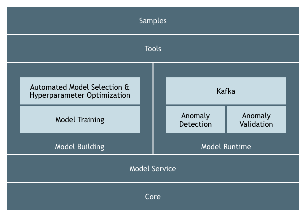

# Adaptive Alerting

Streaming anomaly detection with automated model selection.

## Modules

Adaptive Alerting is organized into a number of modules, shown above. Here's what they are:

- **Core** is common library code used across multiple modules. This includes domain concerns like model evaluation as
  well as utilities.
- **Model Service** is essentially a data service for the whole AA platform.
- **AMS/HPO** (we'll come up with a better name) is the "adaptive" part of Adaptive Alerting. It’s where we
  automatically figure out which tuned model to assign to a given metric.
- **Model Training** is the model training engine.
- **Anomaly Detection** is the first of a two-phase anomaly detection process. Here the goal is to identify likely
  anomalies very quickly.
- **Anomaly Validation** is the second anomaly detection phase. Here the goal is to limit false positives, since false
  positives undermine the usefulness of an anomaly detection system. This phase isn't as fast since it generally
  involves investigation (which here is automated).
- **Kafka** is the Kafka wrapper on the runtime.
- **Tools** are model development tools (e.g., data sources, visualization).
- **Samples** are sample data pipelines that we create using the tools.

For more details, see

- [Architectural overview](docs/architecture.md)
- [Core platform](core/README.md)
- [Kafka deployments](kafka/README.md)
- [Development tools](tools/README.md)
