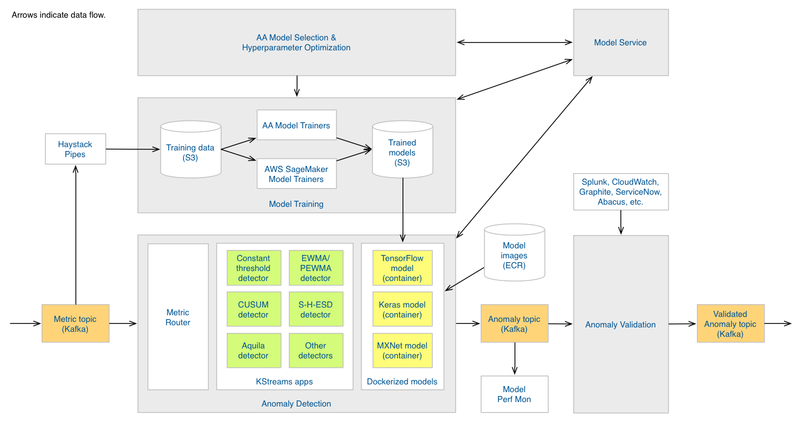
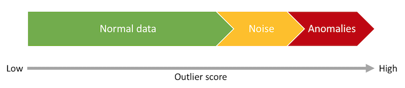

# Adaptive Alerting architectural overview

This page describes the Adaptive Alerting architecture in its current form. This
is a living document: no doubt the architecture will evolve as we develop a
deeper understanding of the domain.

Adaptive Alerting has five modules, which appear as larger gray boxes in the
diagram. Below I describe their role in the overall system.

## anomaly detection

The _Anomaly Detection_ module is the heart of the system. It accepts incoming
metric points and classifies them as normal, weak anomalies or strong anomalies.
This classification is an initial signal indicating a possible anomaly. Anomalies
(whether weak or strong) feed into the Anomaly Detection module for further
analysis. (See [Uber's blog post on Argos](https://eng.uber.com/argos/),
describing an anomaly detection system with the same sort of split.)

The emphasis for anomaly detection is _speed_. Most incoming metric points are
normal, and we want to filter them out to avoid unnecessary processing, which
helps us scale the number of metrics we can process.

Within the anomaly detection module, the primary abstraction is an anomaly
detector. This is a component that accepts a metric point and classifies it in
the manner described above. Different anomaly detectors use different approaches
to performing the classification. One kind of anomaly detector is a constant
threshold detector, which simply checks to see whether the metric point exceeds
a fixed threshold. Other anomaly detectors account for seasonalities and trends
in the data.

Simpler anomaly detectors like constant threshold, EWMA or PEWMA generally don't require offline training. But more
complex ones often do. For example, neural network detectors like LSTM involve offline training. To support these, you
can deploy Docker containers that know how to handle [custom anomaly detection models](custom-od-models.md) of a given
type. Your detectors can use these models to perform anomaly detection. The container pulls trained models down from a
model store, such as S3.

When a metric point comes in, we need to route it to the right detector type.
For instance, if a disk available metric comes in, we would probably want to
pass this to a constant threshold detector. If a sales-related metric point
arrives, we probably want that to go to a detector that's equipped to handle
seasonality and trend. This is where the _Metric Router_ comes in. It inspects
the metric point and then routes it to the correct detector.

Finally, we need to ensure that models are producing good time series
predictions and anomaly classifications. The _Performance Monitor_ tracks these
concerns:

- For time series model fit we will use standard measures such as RMSE or sMAPE.
  If the model fit is poor, the Performance Monitor can schedule a model rebuild
  with the model training module, or else simply log the issue for further
  remediation.
- For anomaly classifications, since the anomaly detection module provides a
  pre-filter into Anomaly Detection, we would track classification
  [precision and recall](https://en.wikipedia.org/wiki/Precision_and_recall);
  i.e., the extent to which the anomaly detector captures all and only ground
  truth anomalies. It is an open problem how we will establish ground truth
  here. We can probably use outputs from the Anomaly Detection module as a
  rough proxy here. Other possibilities include simulation and user feedback
  loops.

## Anomaly Validation

The _Anomaly Validation_ module is the second phase of the metric processing
pipeline. Its purpose is to decide for any given anomaly whether that anomaly
represents an anomaly (roughly, an interesting change to the underlying
data-generating process), and if so, whether the anomaly is weak or strong.

It may sound funny that an anomaly can come in but not represent an anomaly.
This is both possible and common. Most data-generating processes involve some
level of noise, and random sampling itself introduces additional noise in the
form of [sampling error](https://en.wikipedia.org/wiki/Sampling_error). So the
boundary between noise and anomaly usually isn't crisp:

(Figure adapted from one in _Outlier Analysis_ by Charu C. Aggarwal.)

The emphasis for anomaly validation is on _correctness_. Specifically, we are
trying to avoid false positives. This is more computationally expensive than
anomaly detection, which is why we divide the overall process into a faster
filtering process and a slower but more careful verification process.

The design of this module is TBD, but I envision some kind of provider-based
design where we have different strategies for deciding whether anomalies
represent true anomalies, and then perhaps an aggregation layer on top to
create an ensemble-based approach. For example, we can imagine having a
rules-based provider that makes certain Splunk queries depending on the metric
involved, and various ML-based providers (naive Bayes classifiers, multiple
logistic regression, neural network classifiers, etc.) to help decide whether an
outlier represents an anomaly.

We will also need to evaluate the anomaly validation classifications. Precision, recall and F measure make sense here too.

## Model Training

Above we noted that some anomaly detectors require offline training. The _Model
Training_ module is where we do this. We siphon data off of the metric topic
using Haystack Pipes and dump that into S3. Then we run model training
algorithms on the training data, generally at regular intervals to ensure that
models stay fresh. We store the trained models in S3 for use by the Anomaly
Detector module.

Note AWS SageMaker in the diagram. This is just one example--the intent is that
we can use external ML platforms and frameworks (e.g., TensorFlow, MXNet, Keras)
to train models as well as using trainers that ship with Adaptive Alerting.

Users can also train [custom anomaly detection models](custom-anom-models.md).

## Model Selection and Hyperparameter Optimization

One of the goals for Adaptive Alerting is to be able to scale up to managing
alerts for millions of metrics. To achieve this scale, we need an automatic way
to identify for any given metric the best (or at least a reasonable) model and
hyperparameters. The _Model Selection and Hyperparameter Optimization (MS/HPO)_
module is responsible for accomplishing this task.

What counts as "the best" is to some extent subjective. The core concern is RMSE
(or similar) performance under modern data splitting and resampling approaches.
But that's not the only factor. We also care about things like model simplicity,
interpretability, and computational cost in both training and deployment
contexts. See chapter 4 in _Applied Predictive Modeling_ (Springer) for a
discussion, as well as a general scheme for model selection.

As with the Anomaly Detection module, the design for this module is TBD. A
provider model might make sense here too. For example, for model selection,
there could be a rule-based provider that select candidate model types based on
tags on the metric point. For HPO, there could be providers for random search
and grid search. [AutoWEKA 2.0](http://www.jmlr.org/papers/volume18/16-261/16-261.pdf)
even describes a Bayesian optimization process to solve a combined MS/HPO
problem.

## Model Service

The _Model Service_ provides general-purpose data management services for the
other modules. It will contain for example metric-to-model mappings, model build
metadata, model evaluation results and so forth.
