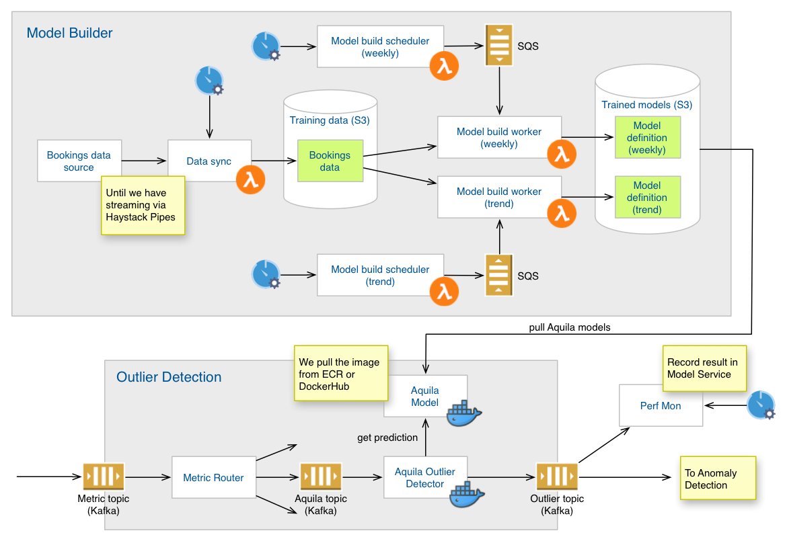

# Custom anomaly detection models

One goal for Adaptive Alerting is to support the training and deployment of custom anomaly detection models for time
series.

The following diagram shows an example of what this looks like for one such model that we developed at Expedia, called
Aquila.

We'll look at each piece in turn.

## Model builder

**Overview.** We use Aquila models to model bookings time series. These models have the following structure:

- A midpoint model, which includes
  - a weekly seasonal component, and
  - a trend component
- A band model (not shown in the diagram)

The seasonal component requires a large amount of data and doesn't change that often, so we build it separately from the
trend component, which requires less data and evolves more rapidly than the seasonal component does.

**Bookings data source.** Right now this is an external source of bookings data that we query for data. Later it will be
a Kafka topic with streaming time series data.

**Data sync.** For now this is a sync job that runs on a cron schedule and pushes data into S3. We will change this to
Haystack Pipes once we switch the data source over to the Kafka topic.

**Training data.** This is where we land our training data. The exact details in terms of the structure (buckets,
folders, files) and format are TBD. For example this could be a bucket for bookings data with folders to organize the
data files. The data files could be CSV, JSON, [Parquet](https://en.wikipedia.org/wiki/Apache_Parquet) or something
else.

**Model build schedulers.** We need to rebuild models from time to time, as the fit often degrades over time as the
underlying data-generating process changes. The model build schedulers run on a cron schedule and periodically push
model build tasks into a queue, where model build workers pick them up and build the models. The model build schedulers
obtains the model build schedules and build hyperparameters from the Model Service (not shown). The schedulers also
check the Model Service for failed Perf Mon evaluations, which would signal the need for a new build.

**Model build workers.** This is a pool of workers to execute model build tasks.

**Trained models.** These are the outputs of the model build process. Note that trained models should generally allow
users to adjust the threshold sensitivity without having to rebuild the model. In Aquila's case, the band model is
roughly an estimate of the standard deviation, and it's up to the user to provide the number of sigmas to use for
warning and critical thresholds. This user-provided sensitivity is not part of the model itself. We store it separately
in the Model Service (not shown).

## Anomaly detection

**Overview.** This is the runtime system for anomaly detection. It applies anomaly detectors to incoming metric streams
to generate a fast, initial classification (normal, weak anomaly, strong anomaly) before passing the classified metric
points to the Anomaly Validation model for further analysis.

**Metric topic.** Incoming metrics arrive here.

**Metric Router.** This component inspects each metric point and routes it to any mapped detectors. The mapping comes
from the AA Model Service (not shown).

**Aquila Outlier Detection Model.** This is the executable version of the Aquila model. It provides an HTTP interface to
the outlier detector. Internally it knows how to grab the model component definitions from S3 and the thresholds from
the Model Service, and then assemble them into a runnable model. (**TODO** Decide how we want to separate the time
series predictor from the outlier classifier. These are distinct concerns.) 

**Aquila Outlier Detector.** This classifies incoming metric points as normal, weak outliers or strong outliers, based
on the model.

**Outlier topic.** The outlier detector publishes classified metric points here.

**Perf Mon.** (Time series) performance monitor. This captures all metric points and updates an internal, streaming
measurement of fit via RMSE and/or other measures. Periodically the Perf Mon publishes the evaluations to the Model
Service, which allows the build schedulers to determine whether a model build is in order.
