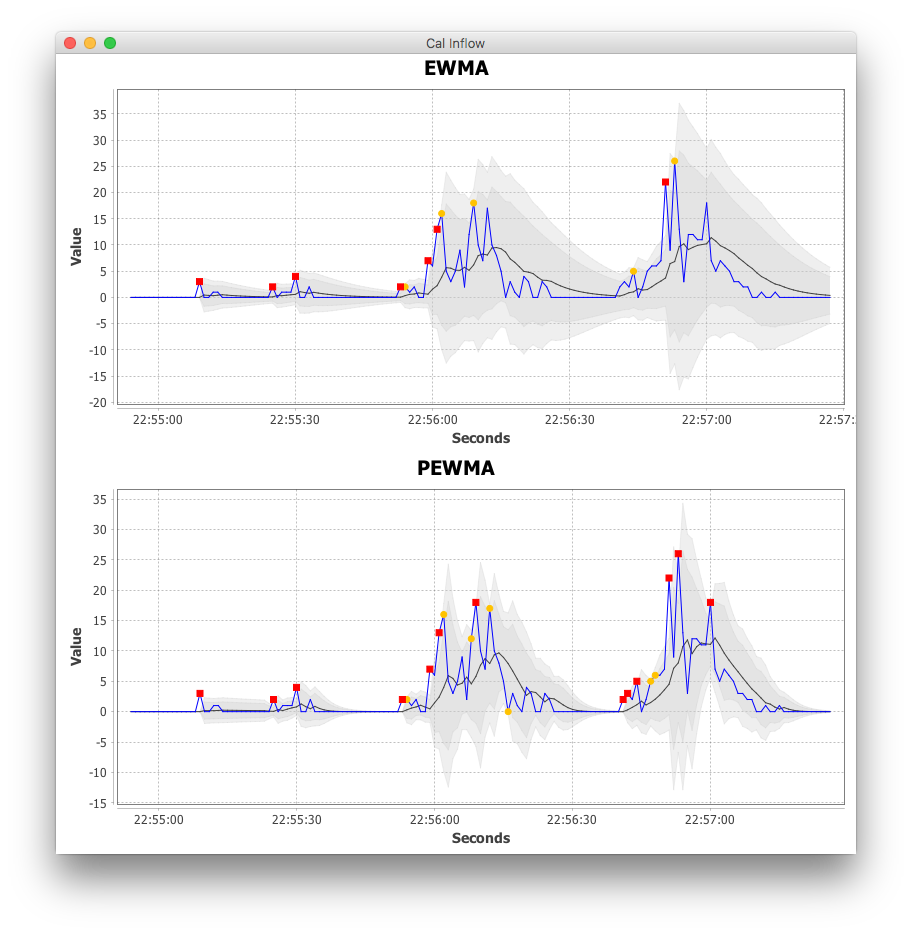

# Adaptive Alerting - Tools

This module provides tools support for common model development needs.

## Data pipelines

We have a data pipeline mini-framework. This allows you, as a model developer, to create runtime data pipelines that
include data sources, filters and sinks without having to run everything through a messaging infrastructure.

These pipelines are intended purely for development purposes as they lack the production-ready features of messaging
systems like Kafka or Kinesis.

Here's a sample pipeline:

```
public class CsvPipeline {
    
    public static void main(String[] args) {
        final InputStream is = ClassLoader.getSystemResourceAsStream("samples/sample001.csv");
        final MetricSource source = new CsvMetricSource(is, "data", 200L);
        
        final MetricFilter ewmaFilter = new OutlierDetectorMetricFilter(new EwmaOutlierDetector());
        final MetricFilter pewmaFilter = new OutlierDetectorMetricFilter(new PewmaOutlierDetector());
        
        final ChartSeries ewmaSeries = new ChartSeries();
        final ChartSeries pewmaSeries = new ChartSeries();
    
        source.addSubscriber(ewmaFilter);
        source.addSubscriber(pewmaFilter);
        ewmaFilter.addSubscriber(new ConsoleLogMetricSink());
        ewmaFilter.addSubscriber(new ChartSink(ewmaSeries));
        pewmaFilter.addSubscriber(new ConsoleLogMetricSink());
        pewmaFilter.addSubscriber(new ChartSink(pewmaSeries));
        
        showChartFrame(createChartFrame(
                "Cal Inflow",
                createChart("EWMA", ewmaSeries),
                createChart("PEWMA", pewmaSeries)));
    
        source.start();
    }
}
```

Here's the associated visualization:



(Note: We'll add threshold bands and running RMSE shortly.)

See the `com.expedia.adaptivealerting.samples` package for other examples of how to create data pipelines.
